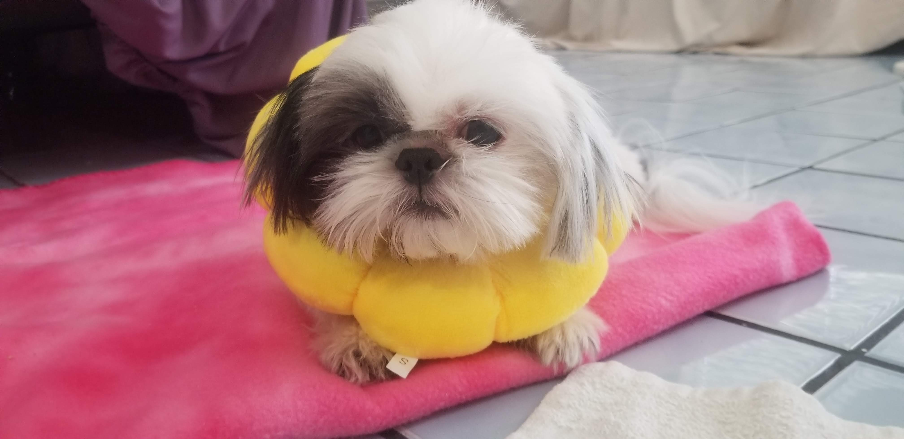

# About Me
**Hello World**

## [The Professional]

My name is Britney Vi and I am a 2nd year transfer at UCSD. My aspirations as a programmer are to apply my programming skills and knowledge to cybersecurity. 

Here are a few of my professional goals for the next year: 
- [ ] Get my Comptia Sec+ Certification
- [ ] Get my Comptia A+ Certification 
- [ ] Reach 50 connections on Linkedin
- [ ] Get an internship or more research 
- [ ] Graduate

My Favorite programming language: 
```
    #import <iostream>

    cout << "My favorite programming langauge is C++, but I am also slowly becoming more familiar with python." >> endl; 
```

## [The Personal]

[Q&A](qna.md)

My favorite quote: 
>The older I get the more that I see

>My parents aren't heroes, they're just like me

When it comes to my personal life I have a couple of interests: 
- cooking
- baking 
- embroidering 
- reading 

Having a dog is like half of my personality, so here are some facts about my dog: 
1. Her name is MJ.
2. She is five years old.
3. She is a shih tzu.
4. She is 8 and a half pounds of pure fluff. 
5. I tried to make an instagram for her and quickly lost motivation.
6. Bonus a picture: 
   

## [Talk to Me!]
How to get into contact with me: 
[Linkedin!](https://www.linkedin.com/in/britney-vi/)

[Github!](https://github.com/BritneyVi)

Email! : bvi@ucsd.edu
